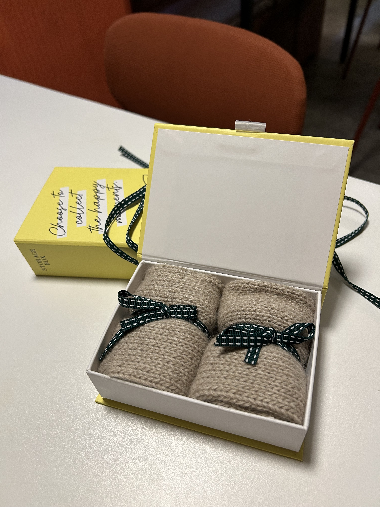
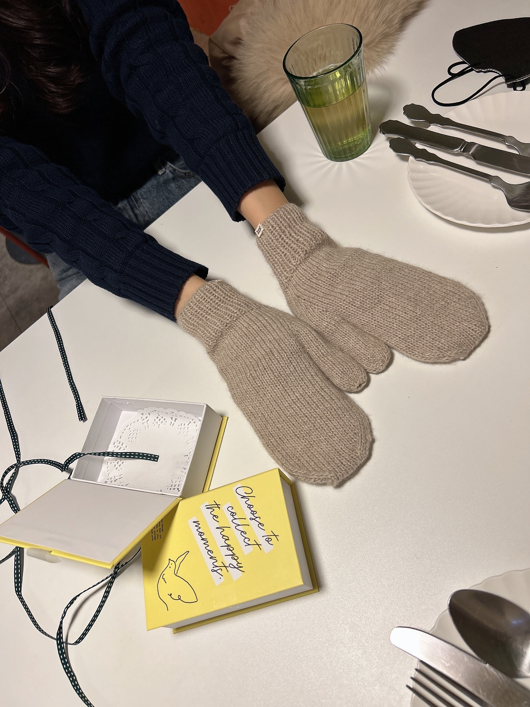
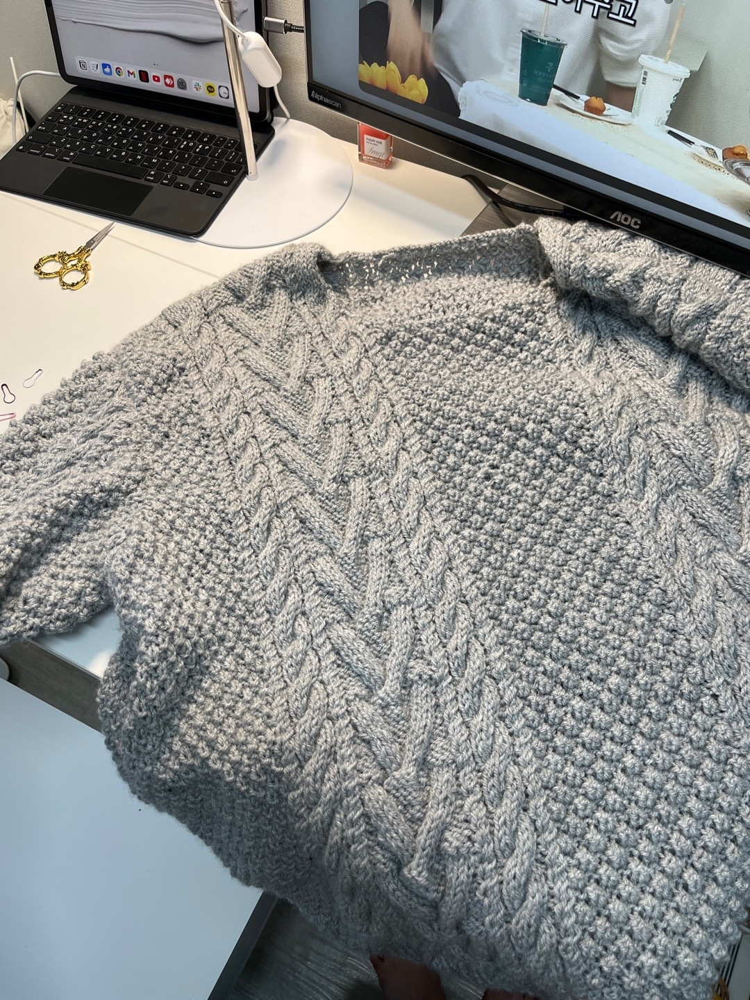
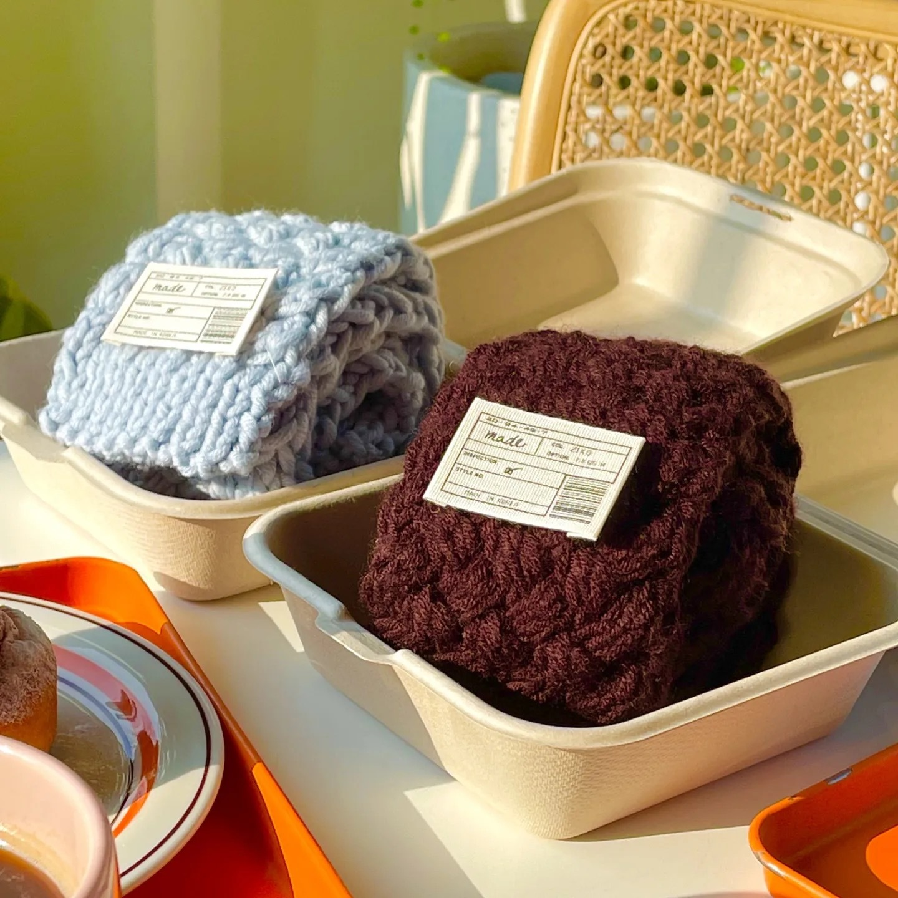
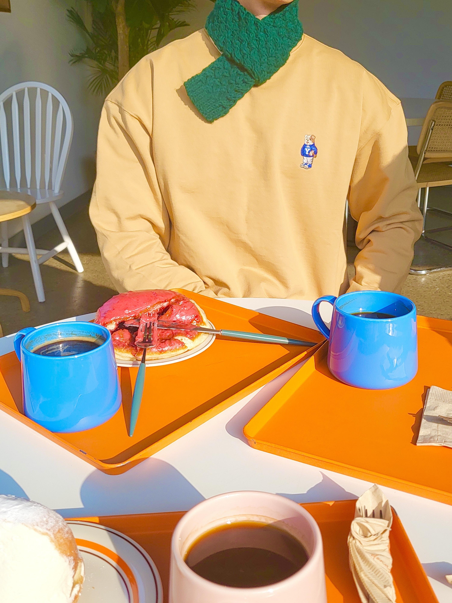
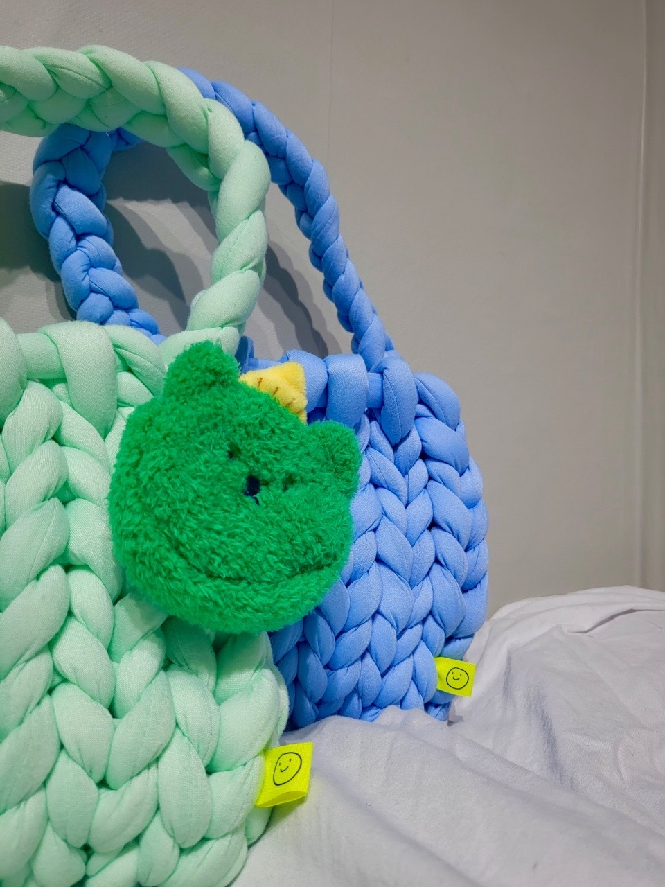

Welcome to my knitting and handicrafts collection! 🏡✨  
Here are some of my handmade creations.  

## 🖼️ My Works

  

    <h3>🌿 Handcrafted Wool Mittens</h3>
    
  

  

    <h3>🌿 Handcrafted Wool Mittens</h3>
    
  

  

    <h3>🍂 Autumn Sweater</h3>
    
  

  

    <h3>🧣 Cozy Scarf</h3>
    
  

  

    <h3>🧣 Cozy Scarf</h3>
    
  

  

    <h3>🎒 Chunky Knit Bags </h3>
    
  

📌 **Click on an image to view full size!** 🖼️

---

📍 **[Back to Home](/)**

